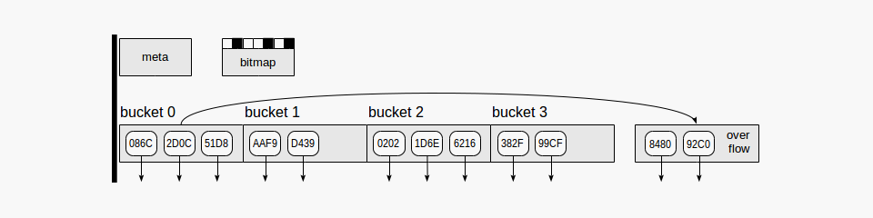

## 1\. Hash 인덱스란?

해쉬 인덱스의 기본 아이디어는, hash function을 통해 작은 숫자를 데이터와 조합하여 integer 형태의 해쉬값 (최대 2^32 = 4B)을 생성하고 해쉬값을 테이블 행 정보(TID)가 저장될 배열의 인덱스 값으로 사용하는 것이다. 이 배열의 각 요소를 해시 테이블 버킷(hash table bucket)이라고 한다. 데이터 조회 시, hash function을 통해 생성된 key가 포함된 bucket을 찾고, 그 bucket만 확인하면 실제 데이터의 위치를 바로 확인할 수 있다. 데이터의 크기에 상관없이 인덱스의 크기가 작고 검색이 빠르다. 1개의 데이터를 조회하는 시간은 O(1)로 빠르지만 해쉬 테이블 내의 값들은 정렬이 되어있지 않기 때문에 범위 비교나 부정형 비교가 포함된 조건에서는 인덱스를 사용할 수 없다. Hash function이 버킷 단위로 소스 값을 더 균일하게 분배할수록 효율이 좋다. 

### ▪ 1-1. Collision

그러나 아무리 좋은 해시 함수라도 다른 키 값에 대해 동일한 해쉬값을 리턴하는 경우가 있고 이런 경우를 “충돌(collision)”이라고 한다.  하나의 버킷은 서로 다른 TID를 저장할 수 있으므로 인덱스에서 얻은 실제 값을 재확인하여야 한다. 예를들어, 256개의 버킷이 있다면, 모든 문자열의 첫 글자로 해쉬값을 생성할 수 있다. 이 경우 동일한 문자로 시작하는 모든 문자열이 동일한 해쉬값을 가진 채로 한 버킷으로 들어갈 것이고, 실제 버킷에서 값이 찾아진 후에도 TID의 검증이 계속 필요할 것이며, 해싱의 의미가 없어질 것이다. 

이를 방지하기위해  Hash function은 hashcode - TID 쌍을 순차적으로 저장하여 효율적으로 bucket 내 동일 hash codes들 중에 정확히 일치하는 TID만을 찾는다.

## 2\. Hash 인덱스 구조

-   **Meta page** - Root, 첫 번째 page, 인덱스 정보 포함
-   **Bucket pages** - 인덱스의 메인 page, "hash code - TID" 쌍으로 데이터를 저장
-   **Overflow pages** - bucket pages와 동일한 구성, 한 page가 버킷에 부족할 때 사용됨
-   **Bitmap pages** - overflow pages를 계속해서 추적하며  clear 한 지, 다른 버킷에서 재사용 가능한지 확인한다

해쉬 인덱스의 크기는 줄어들지 않는다. 인덱스 열을 삭제하여도 한번 할당된 bucket은 os로 반환되지 않는다. Vacuuming, reindexing을 통해 전체 삭제 후 처음부터 다시 인덱싱은 가능하다.

#### ▪ 결론

-   Hash 인덱스는 단일 값 검색에서는 효율적인 성능을 보인다. (B-Tree에 비해 작은 인덱스 size, O(1))
-   범위, 부정형 조건에 대한 검색에서는 사용 불가하다.
-   한번 생성된 버킷은 인덱스를 제거하여도 초기화 전에는 메모리에 반환되지 않는다.

참고 : [https://postgrespro.com/blog/pgsql/4161321](https://postgrespro.com/blog/pgsql/4161321)