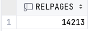
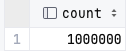
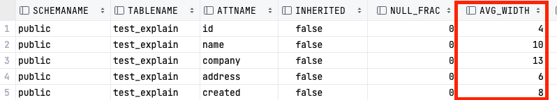
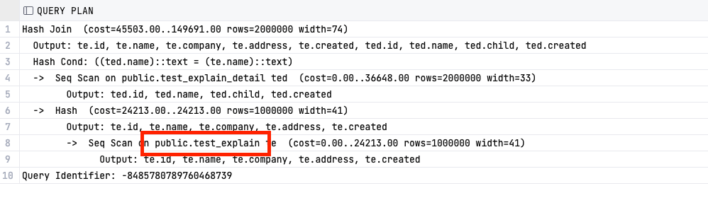
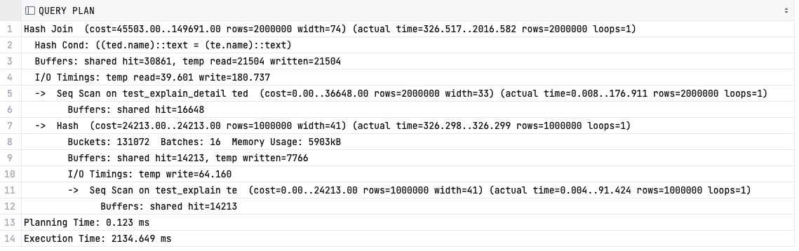
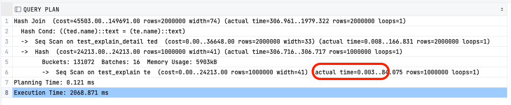
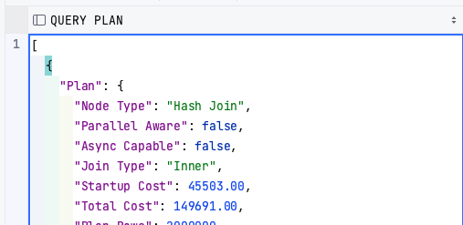

## 1\. 실행 계획 확인

```
--Synopsis
EXPLAIN [ ( option [, ...] ) ] 쿼리문
EXPLAIN [ ANALYZE ] [ VERBOSE ] 쿼리문

option 자리에 사용할 수 있는 것들:

    ANALYZE [ boolean ]
    VERBOSE [ boolean ]
    COSTS [ boolean ]
    BUFFERS [ boolean ]
    TIMING [ boolean ]
    FORMAT { TEXT | XML | JSON | YAML }
```

**\* 이후 설명에서 사용될 테스트 데이터는 아래의 "7. 테스트 데이터 생성" 부분 쿼리 확인**

## 2\. EXPLAIN이란?

EXPLAIN을 통한 실행 계획 확인은 PostgreSQL PLANNER가 만든 쿼리 플랜을 보여준다. 조건에 부합하는 자료를 찾기 위해 어떤 테이블 및 인덱스를 조회하는지, 어떤 SCAN 방식을 사용하는지, 각 테이블별 조인 알고리즘은 어떤 것을 사용하는지를 보여준다.

```
EXPLAIN ANALYZE SELECT * from TEST_EXPLAIN;
```

<p align="center"></p>

테스트 테이블의 100만개의 행을 조건 없이 조회했을 때의 플랜 조회이다.

## 3\. EXPLAIN 항목별 의미

EXPLAIN ANALYZE를 통해 단순히 실행 시간만으로 쿼리 튜닝을 진행하는 것은 옳지 않다. 동일 쿼리를 반복적으로 실행할 경우 캐쉬로 인해 속도가 향상되고, ANALYZE를 위한 코스트가 추가되기에(6-2. 주의사항 참고) 실제 스캔방식이나 인덱싱 등 세부 노드별 상세 지표를 확인하여 튜닝을 진행하여야 한다.

###           **3-1. COST**

전체 COST 계산을 위해, 테이블의 ROWS 수와 BLOCK수를 확인한다.

```
-- PAGE(BLOCK) 수 조회 (테이블명 소문자로만 조회 가능)
SELECT relpages FROM pg_class WHERE relname = 'test_explain';

-- 전체 ROW 수 조회
SELECT COUNT(*) FROM test_explain;
```

<p align="center"></p>
<p align="center"></p>

이 수치에서 14,213개의 PAGE를 로드하는 COST와 1,000,000개 ROW를 연산하는 COST를 계산하면 된다.

> (# of pages) \* (page load cost) + (# of rows) \* (row 처리 cost)

PAGE를 데이터베이스의 저장장치로 부터 읽어서 로드하는 작업보다, 이미 로드되어 정렬된 ROW DATA를 처리하는 과정이 훨씬 빠르고 가볍다. PAGE 로드 과정과 ROW 처리하는 비용을 100:1이라고 가정하면

> 14213 \* 1 + 1000000\*0.01 = 24213

24,213은 먼저 확인한 쿼리플랜의 COST와 동일한 값이다. 100:1로 가정한 수치가 어떻게 COST와 정확히 일치할 수 있을까? PLANNER의 COST 자체도 실제 비용이 아닌 다른 작업들을 수행하는데 드는 COST의 상대적인 값이기 때문이다. 메모리 및 CPU의 정확한 수치 계산이 아닌 다른 작업에 비해 몇 배가 되는가에 대한 COST이다.

###           **3-2. ROWS**

COST 계산식에서 확인한 대로 전체 ROW의 개수이다. 현재 샘플 테이블에서는 1,000,000개 ROW가 있기에 해당 수치가 그대로 나오게 된다.

###           **3-3. WIDTH**

컬럼별 평균 byte 수이다. ANALYZE 옵션을 통해 실행을 시키지 않아도 해당 값은 확인할 수 있는데, 그 이유는 PostgreSQL에서 각 테이블에 대한 상세 통계를 별도 보관하고 있기 때문이다. 그래서 테이블을 크게 수정한 경우에는 Vacuum을 통해 통계정보를 재집계해야지 올바른 플랜을 획득할 수 있다.

```
SELECT *
FROM pg_stats
WHERE tablename = 'test_explain';
```

<p align="center"></p>

4+10+13+6+8은 통계값에서 확인한 41과 일치한다.

###           **3-4. **\[ANALYZE\]** ACTUAL TIME**

ANALYZE 옵션을 사용할 때만 확인가능한 파라미터이다. 실제 쿼리를 수행하는데 소모된 시간을 보여주며 \[값 1.. 값 2\] 형태로 표현된다. 앞부분(값 1)은 작업 결과로 첫 번째 row를 리턴하기 전까지 비용이고, 뒷부분(값 2)은 마지막 로우를 리턴할 때까지의 비용이다.

대부분의 쿼리는 실행하는데 첫 번째부터 마지막까지 전체 소요시간을 파악해야 하지만

####                     **3-4-1. EXISTS**

EXISTS 구문을 사용하는 서브쿼리 같은 경우 총비용(값 2) 대신 첫 번째 시작비용(값 1)으로 쿼리 플랜을 짠다. EXISTS 구분은 존재여부만 파악되면 이후 데이터의 작업을 중지하기 때문에 총비용(값 2)에 대한 비용을 확인할 필요가 없기 때문이다.

####                     **3-4-2. LIMITS**

LIMIT의 경우 출력 범위가 전체에서 어느 부분인지를 파악한 후 총비용과 최적화된 COST를 고려해 계산한다.

###           **3-5. \[ANALYZE\] ROWS**

통계에서 나온 값이 아닌 실제 조회한 ROWS 수이다.

###           **3-6. \[ANALYZE\] LOOPS**

서브플랜의 노드가 1회 이상 조회되는 경우들이 있다. 예를 들어 inner 인덱스 스캔은 nested-loop플랜에서 outer row당 한 번씩 실행된다. 이 경우 ROW당 조회되는 카운트를 표현한 값이다. 해당 예제에서는 단일 테이블 조회로 LOOP가 1회 발생하였기에 1로 조회되었다.

## **4\. EXPLAIN ANALYZE** 

ANALYZE 옵션을 사용하면 실제 쿼리가 실행되고, 추정비용과 함께 소요비용, 소요시간, 실제 처리된 계획 노드별 전체 로우 수도 보여준다. 추정비용과 실제비용을 같이 보여주기에 Planner가 짐작하는 작업이 실작업에 비해 얼마나 정확한지 보는데도 유용하다

실제로 실행되기 때문에 운영 데이터베이스에 사용할 때는 주의해야 한다. 오래 걸리는 SELECT문은 물론 UPDATE, DELETE, INSERT, CREATE TABLE AS, EXCUTE의 경우 운영데이터베이스에 직접적인 영향을 주기에 트랜잭션 블락에서 처리 후 바로 롤백하는 방법으로 처리하는 것을 권장한다.

```
BEGIN;
EXPLAIN ANALYZE ...;
ROLLBACK;
```

## **5\. EXPLAIN 추가옵션 (상세 정보 확인)**

###           **5-1. VERBOSE**

```
EXPLAIN (VERBOSE )
SELECT * from TEST_EXPLAIN TE
join test_explain_detail TED
on TE.name = TED.name
```

<p align="center"></p>

-   실행계획 추가정보를 보여준다. 단계별 모든 컬럼 목록을 보여준다
-   테이블, 함수에는 해당 스키마 명을 보여준다.
-   조건절에서 사용한 컬럼들도 테이블명과 함께 보여준다.
-   통계 정보가 출력되기 위한 각 트리거의 이름을 보여준다.
-   초기값은 FALSE이다.

###           **5-2. BUFFERS**

```
EXPLAIN (ANALYSE, buffers true )
SELECT * from TEST_EXPLAIN TE
join test_explain_detail TED
on TE.name = TED.name;
```

<p align="center"></p>

버퍼 사용량을 보여준다. 특히 공유 BLOCK, 로컬 BLOCK, 임시 BLOCK의 HIT, 읽기, 쓰기, 변경 내용을 포함한다.

(여기서 Hit 이란 필요한 시점에 해당 블럭이 캐쉬에 있기에 읽기가 생략된 단계이다.)

-   **공유 블럭** - 일반 테이블, 일반 인덱스에 대한 데이터를 저장한다.
-   **로컬 블럭** - 임시 테이블, 임시 인덱스에 대한 데이터를 저장한다.
-   **임시 블럭** - 정렬, 해쉬, 구체화된 뷰, 실행계획 세부 단위자료와 같은 단기 작업에 사용된 데이터를 저장한다.

결과에 나오는 항목 중 dirted 블럭은 해당쿼리로 변경된 블록의 수이고, written 블럭은 해당 쿼리가 실행되며 세션이 공유버퍼에서 변경된 블록을 디스크에 기록한 수이다. 실행이 필수이므로 ANALYZE 옵션과 같이 사용해야 하며 초기값은 FALSE이다.

###           **5-3. TIMING**

```
EXPLAIN (ANALYSE, TIMING TRUE )
SELECT * from TEST_EXPLAIN TE
join test_explain_detail TED
on TE.name = TED.name;
```

<p align="center"></p>

-   실제 각 노드별 소모 시간을 보여준다.
-   반복적으로 시스템 시간을 확인하는데서 오는 부하는 쿼리의 성능을 굉장히 저하시킬 수 있기 때문에 정확한 시간이 필요한 것이 아니라면 FALSE로 두는 것이 좋다.
-   FALSE 상태로 노드 단위의 시간을 보지 않는다 해도 해당 쿼리의 총 실행시간은 항상 계산된다.
-   실행이 필수이므로 ANALYZE 옵션과 같이 사용해야 한다.
-   초기값은 FALSE이다.

###           **5-4. FORMAT**

```
EXPLAIN (ANALYSE, FORMAT JSON )
SELECT * from TEST_EXPLAIN TE
join test_explain_detail TED
on TE.name = TED.name
```

<p align="center"></p>

-   실행계획 값을 TEXT, XML, JSON, YAML의 형식으로 출력한다. 
-   초기값은 TEXT이다.

## **6\. EXPLAIN 정리 및 주의사항**

###           **6-1. VACUUM**

PostgreSQL 쿼리 플래너가 유효한 실행계획을 만들기 위해 쿼리에 포함된 모든 테이블에 대한 pg\_statistic 데이터는 최신화되어야 한다. 보통 Auto Vacuum을 통해 관리되지만 (Vacuum은 이 포스트에서 상세 내용을 확인할 수 있다.)

[\[PostgreSQL\] Vacuum 개념 및 적절한 사용](https://github.com/junhkang/postgresql/blob/main/Vacuum%20%EA%B0%9C%EB%85%90%20%EB%B0%8F%20%EC%A0%81%EC%A0%88%ED%95%9C%20%EC%82%AC%EC%9A%A9.md)

테이블이 최근에 크게 변경되었다면 Auto Vacuum을 기다리거나, 수동 Vacuum으로 즉시 통계 재집계를 실행할 수 있다.

###           **6-2. ANALYZE**

**4\. ANALYZE** 에서 언급한 주의사항 외에도, 실행계획의 노드별 실행 시간을 측정하기 위해 EXPLAIN ANALYZE를 사용하면 시간을 측정하는 부하도 같이 측정된다. 결국 EXPLAIN ANALYZE가 실제 쿼리보다 현저하기 오래 걸리는 경우다 있다. 이 비용은 쿼리의 복잡도 및 사용하는 플랫폼에 따라 달라진다. 최악의 경우 실행시간이 아주 짧은 간단한 쿼리가 시스템이 실행시간을 계산하는데 더 오랜 시간이 걸어 실행계획이 이상하게 나오는 경우도 있다.

## **7\. 테스트 데이터 생성**

100만 유저와 유저별 2개의 child를 가지고 있는 디테일 테이블을 생성한다.

```
-- 테스트 테이블 생성
CREATE TABLE test_explain (
    id serial PRIMARY KEY,
    name varchar(255),
    company varchar(255),
    address varchar(255),
    created timestamp
);

-- 100만 ROW 인서트
DO $$
DECLARE
    i INTEGER := 1;
BEGIN
    WHILE i <= 1000000 LOOP
        INSERT INTO test_explain(name, company, address, created )
            VALUES(CONCAT('name', i), CONCAT('company', i), CONCAT('addr', i % 100), now() + i * INTERVAL '1 second');
        i := i + 1;
    END LOOP;
END $$;

-- 테스트 연관 테이블 생성
CREATE TABLE test_explain_detail (
    id serial PRIMARY KEY,
    name varchar(255),
    child varchar(255),
    created timestamp
);

-- 200만 ROW 인서트 (한 name당 2개의 child)
DO $$
DECLARE
    i INTEGER := 1;
BEGIN
    WHILE i <= 1000000 LOOP
        INSERT INTO test_explain_detail(name, child, created )
            VALUES
            (CONCAT('name', i), CONCAT('child', i), now() + i * INTERVAL '1 second'),
            (CONCAT('name', i), CONCAT('child', i+1), now() + i * INTERVAL '1 second');
        i := i + 1;
    END LOOP;
END $$;
```

참고

[https://morningcoffee.io/the-postgresql-query-cost-model.html](https://morningcoffee.io/the-postgresql-query-cost-model.html)

[https://www.postgresql.org/docs/9.6/sql-explain.html](https://www.postgresql.kr/docs/9.6/sql-explain.html)

[https://stackoverflow.com/questions/49733675/what-does-loop-in-explain-analyze-statement-mean](https://stackoverflow.com/questions/49733675/what-does-loop-in-explain-analyze-statement-mean)